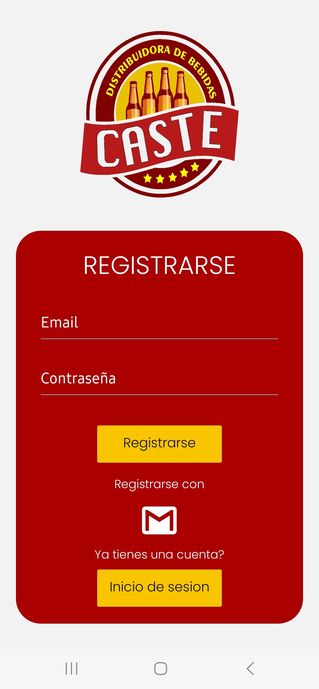
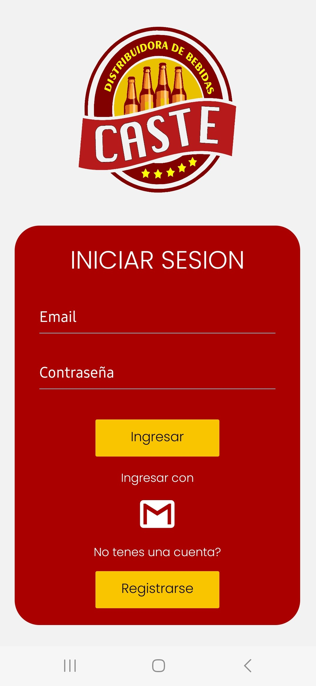
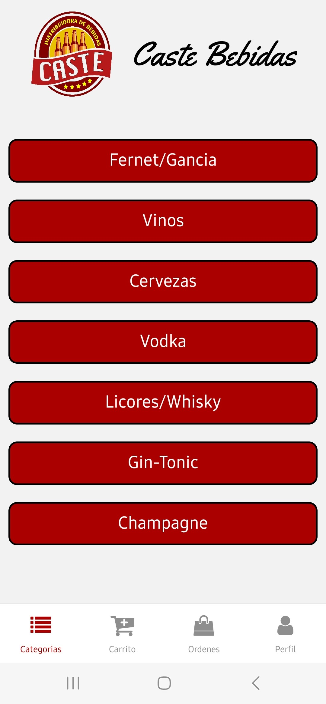
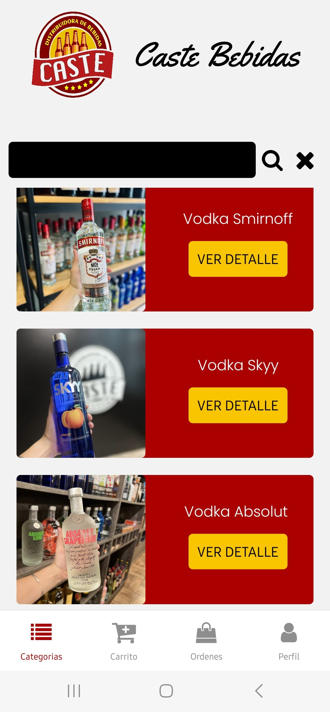
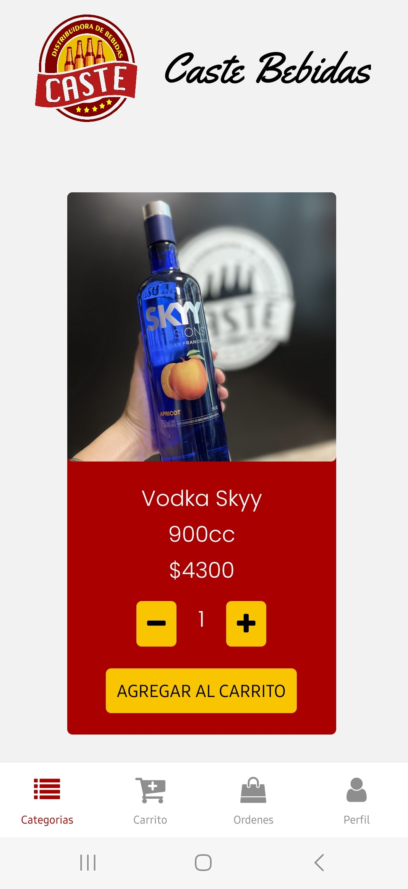
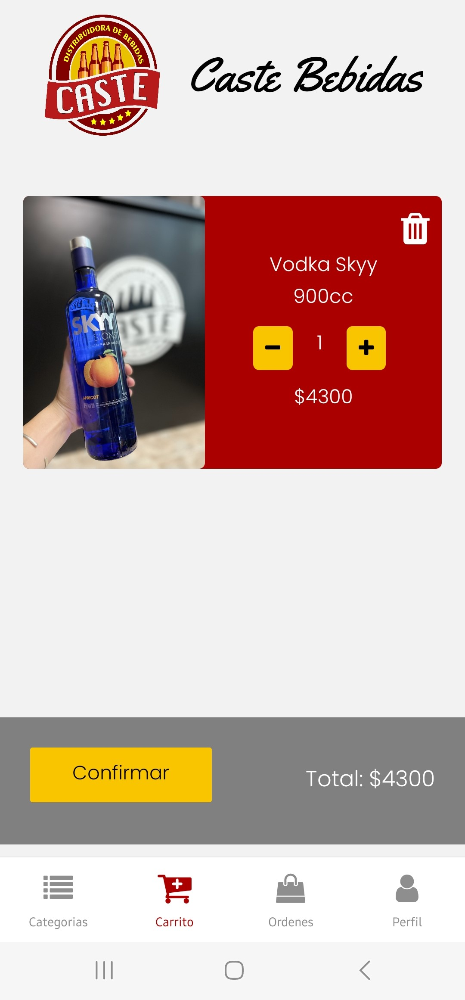
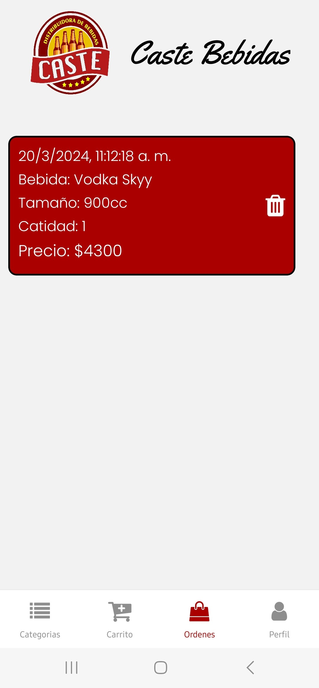

# Caste Bebidas App (React-Native)

Esta es una aplicacion mobile que trata sobre una distribuidora de bebidas creada por medio de React-Native y Expo para un mejor rendimiento tanto en Android como IOS

## Funcionalidades Principales

### Pantalla de Cuenta

- **Acceso seguro:** Solo los usuarios autenticados pueden acceder a la pantalla del perfil y realizar compras.
- **Informacion del usuario:** Muestra detalles del usuario, como nombre y direccion.





### Autenticacion con Firebase

- Utiliza el sistema de autenticación de Firebase para gestionar el acceso de usuarios.
- Permite a los usuarios iniciar sesión y registrarse de manera segura.

### Pantalla de Categorias

- Muestra una selección de categorías en tarjetas.
- Al hacer clic en una categoría, se navega a la pantalla de productos correspondiente.

### Pantalla de Productos

- Lista todos los productos en tarjetas con nombre y foto.
- Incluye un buscador para filtrar productos por nombre.
- Al hacer clic en un producto, se navega a la pantalla de detalles del producto.

### Pantalla de Detalles del Producto

- Proporciona una descripción detallada del producto.
- Muestra el precio y el stock disponible.
- Permite agregar el producto al carrito.







### Navegacion Inferior

```javascript
return (
  <Tab.Navigator
    sceneContainerStyle={{ flex: 1 }}
    screenOptions={{
      headerShown: false,
      tabBarActiveTintColor: "#AB0000",
      tabBarHideOnKeyboard: true,
      tabBarStyle: {
        position: "absolute",
        paddingTop: 5,
        paddingBottom: 10,
        elevation: 0,
        borderWidth: 0,
        height: 70,
        backgroundColor: "white",
      },
    }}
  >
    <Tab.Screen
      name="ShopStack"
      component={ShopStack}
      initialRouteName="ShopStack"
      options={{
        tabBarLabel: "Categorias",
        tabBarIcon: ({ color }) => (
          <FontAwesome name="list" size={24} color={color} />
        ),
      }}
    />
    <Tab.Screen
      name="CartStack"
      component={CartStack}
      initialRouteName="ShopStack"
      options={{
        tabBarLabel: "Carrito",
        tabBarIcon: ({ color }) => (
          <FontAwesome name="cart-plus" size={30} color={color} />
        ),
      }}
    />
    <Tab.Screen
      name="OrdersStack"
      component={OrdersStack}
      initialRouteName="ShopStack"
      options={{
        tabBarLabel: "Ordenes",
        tabBarIcon: ({ color }) => (
          <FontAwesome name="shopping-bag" size={24} color={color} />
        ),
      }}
    />
    <Tab.Screen
      name="ProfileStack"
      component={ProfileStack}
      initialRouteName="ShopStack"
      options={{
        tabBarLabel: "Perfil",
        tabBarIcon: ({ color }) => (
          <FontAwesome name="user" size={26} color={color} />
        ),
      }}
    />
  </Tab.Navigator>
);
```

- **Pestaña 1 - Productos:** Categorías y productos (stack principal).
- **Pestaña 2 - Carrito:** Detalles del carrito de compras con resumen y botón para finalizar la orden.
- **Pestaña 3 - Ordenes:** Historial de órdenes realizadas.
- **Pestaña 4 - Perfil:** Información del usuario, ubicación y carga de imagen de perfil.





### Tecnologias Utilizadas

- **Firebase Authentication:** Implementa el sistema de autenticación de Firebase para gestionar la seguridad de la aplicación.
- **React Native Navigation Stack:** Gestiona la navegación entre pantallas.
- **React Native Navigation Buttom tap:** Gestiona la navegación entre pestañas
- **Expo-Picker-Image:** Facilita la carga de imágenes de perfil.
- **Redux:** Centraliza y gestiona el estado de la aplicación.
- **RTK Query y Firebase:** Realiza operaciones de lectura/escritura en la base de datos.

### Instalación

1. Clona el repositorio `git clone https://github.com/El88Aleman/Caste-Bebidas-React-Native.git`
2. Instala las dependencias `npm install`
3. Configura las claves de API para servicios externos (Expo-Location, Firebase, etc.)
4. Configura las credenciales de Firebase en tu proyecto
5. Ejecuta la aplicacion: `npm start`

### Contacto

- Para preguntas o soporte, contacta a Francobertone10@gmail.com
